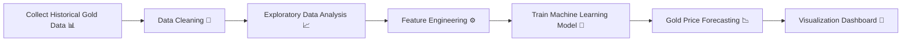

<div align="center">

# 📈 Gold Price Forecasting using Machine Learning

### AI-Powered Gold Market Trend Analysis & Forecasting System


<br>


<br><br>


</div>

---

# 📌 Project Overview

The **Gold Price Forecasting using Machine Learning** project is designed to analyze historical gold price data and forecast future price trends using Machine Learning algorithms and predictive analytics techniques.

This project combines:

* 📊 Data Analysis
* 📈 Trend Forecasting
* 🤖 Machine Learning
* 📉 Data Visualization
* 💹 Financial Analytics

to build an intelligent forecasting system capable of identifying gold market patterns and future price movements.

---

# 💎 Gold Market Visualization

## 🏆 3D Gold Visualization

<p align="center">

</p>

---

# 📊 Gold Price Trend Analysis

## 📈 Historical Gold Price Analysis

<p align="center">

</p>

---

# 📉 Forecasting & Predictive Analytics

## 🤖 Machine Learning Forecast Visualization

<p align="center">

</p>

---

# 📊 Data Visualization Dashboard

## 🥧 Market Distribution Analysis

<p align="center">

</p>

---

## 📊 Comparative Bar Chart Analysis

<p align="center">

</p>

---

# 🚀 Key Features

✅ Gold Price Trend Analysis
✅ Machine Learning-Based Forecasting
✅ Historical Market Data Analysis
✅ Financial Data Visualization
✅ Interactive Analytics Dashboard
✅ Predictive Modeling
✅ Real-Time Insights
✅ Clean & Professional UI
✅ Trend Comparison Analytics

---

# 🧠 Machine Learning Workflow



---

# 🛠️ Tech Stack

<div align="center">


<br><br>


</div>

---

# 📂 Project Structure

```bash id="ztz8oh"
Gold-Price-Forecasting/
│
├── app.py
├── model.pkl
├── dataset.csv
├── requirements.txt
└── README.md
```

---

# ⚙️ Installation

## Clone Repository

```bash id="m1xz0m"
git clone https://github.com/Rajkumarte115/gold-price-forecasting.git
```

## Install Dependencies

```bash id="ayus42"
pip install -r requirements.txt
```

## Run Application

```bash id="v5j8lt"
python app.py
```

---

# 🌟 Future Improvements

* Deep Learning-Based Forecasting
* Real-Time Gold Market API
* Interactive Streamlit Dashboard
* Advanced Financial Analytics
* Enhanced Prediction Accuracy

---

# 📬 Connect With Me

<div align="center">

<a href="https://www.linkedin.com/in/raj-dubey-datascience/">

</a>

<a href="https://github.com/Rajkumarte115">

</a>

</div>

---

<div align="center">

## ⭐ If You Like This Project, Give It a Star ⭐


</div>
